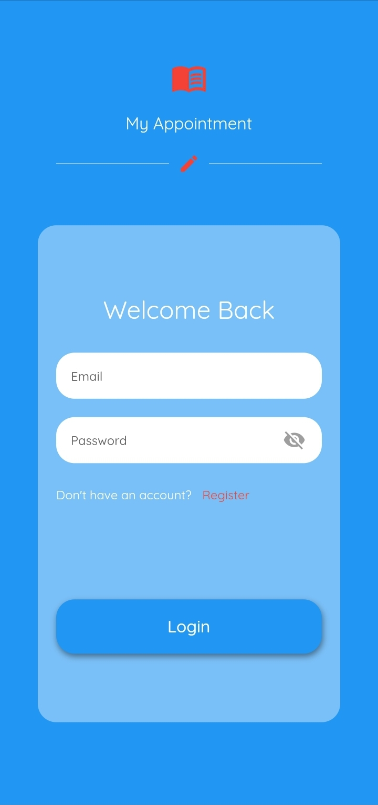
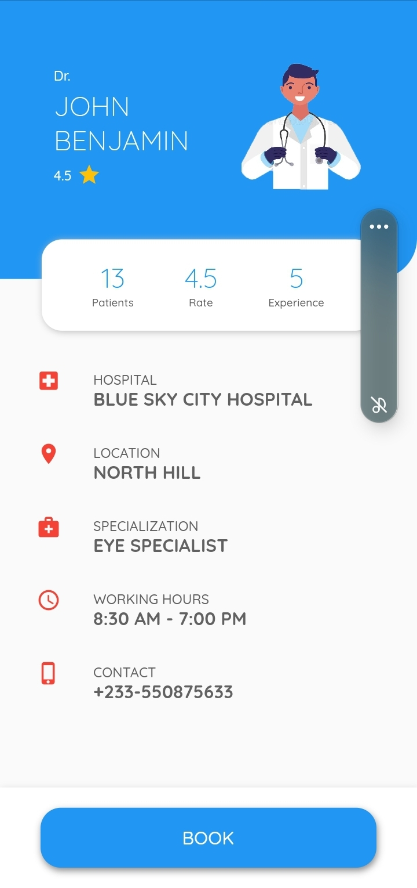

# Flutter Appointment App

Welcome to Flutter Appointment App! This Flutter-powered application helps users manage appointments efficiently.

## Overview
Flutter Appointment App is designed to simplify appointment scheduling and management. Users can easily book, cancel, and keep track of their appointments.

## Requirements
- Flutter SDK
- Dart SDK
- Other dependencies mentioned in `pubspec.yaml`

## Features
- Book and schedule appointments
- View upcoming appointments
- Cancel or reschedule appointments
- Set reminders for upcoming appointments
- User authentication and profiles
- Notifications for appointment reminders

## Links
- [GitHub Repository](https://github.com/your-username/FlutterAppointmentApp)
- [Demo Video](https://your-demo-video-link.com)

## Screenshots

| Login | Home Screen | Details |
|------------------|------------------|----------------|
|  |  |  |

## How to Use
- Register or log in to access the app features.
- Book appointments by selecting available slots or service providers.
- View and manage scheduled appointments in the appointment list.
- Receive notifications and reminders for upcoming appointments.
- Cancel or reschedule appointments if needed.

## Major Packages
- `firebase_core: ^x.x.x`
- `firebase_auth: ^x.x.x`
- `cloud_firestore: ^x.x.x`
- Other packages as listed in `pubspec.yaml`

## Authors
- [Collins Brobbey Jnr](https://github.com/Qweku)
- [Jeffrey Boahen](https://github.com/yellow_Flickr)
